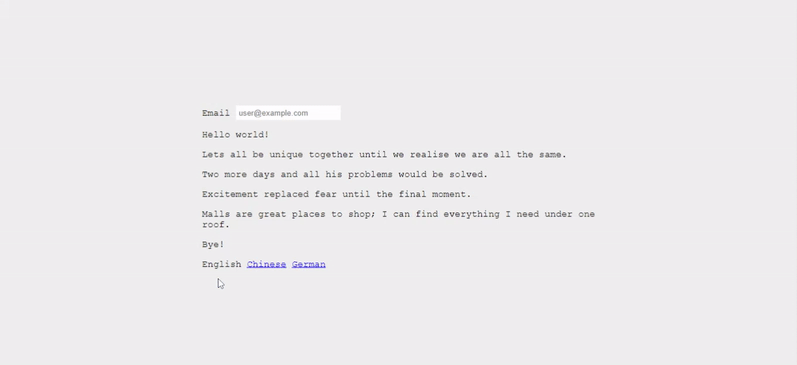

<br />
<p align="center">
    <a href="https://github.com/hazzillrodriguez/flask-multi-language">
        
    </a>
    <h3 align="center">Flask Multi-language</h3>
    <p align="center">
        Make your Flask application user-friendly by adding your own translations and language support!
        <br />
        <a href="https://flask-multi-language.herokuapp.com/">View Demo</a>
        ·
        <a href="https://github.com/hazzillrodriguez/flask-multi-language/issues">Report Bug</a>
        ·
        <a href="https://github.com/hazzillrodriguez/flask-multi-language/issues">Request Feature</a>
    </p>
</p>

<!-- TABLE OF CONTENTS -->
<details>
    <summary>Table of Contents</summary>
    <ol>
        <li>
            <a href="#about-the-project">About The Project</a>
            <ul>
                <li><a href="#built-with">Built With</a></li>
            </ul>
        </li>
        <li>
            <a href="#getting-started">Getting Started</a>
            <ul>
                <li><a href="#prerequisites">Prerequisites</a></li>
                <li><a href="#installation">Installation</a></li>
            </ul>
        </li>
        <li><a href="#usage">Usage</a></li>
        <li><a href="#license">License</a></li>
        <li><a href="#contact">Contact</a></li>
        <li><a href="#acknowledgments">Acknowledgments</a></li>
    </ol>
</details>

## About The Project



Implement internationalization (i18n) and localization (l10n) support in your Flask application by adding your own translations, language support and allow users to pick between languages using the language option switcher.

### Built With

* [Python](https://www.python.org)
* [Flask](https://flask.palletsprojects.com/en/2.0.x/)
* [Flask-Babel](https://flask-babel.tkte.ch/)

## Getting Started

These instructions will get you a copy of the project up and running on your local machine.

### Prerequisites

All the dependencies and required libraries are included in the file `requirements.txt`.

### Installation

1. Git clone or download the project files
```
git clone https://github.com/hazzillrodriguez/flask-multi-language.git
```

2. Create and activate the virtual environment
```
cd flask-multi-language
python -m venv env
source env/Scripts/activate
```

3. Install requirements
```
pip install -r requirements.txt
```

4. Start the development web server
```
export FLASK_APP=run.py
export FLASK_ENV=development
flask run
```

## Usage

Open `config.py` and add your own supported languages.
```python
class BaseConfig(object):
    # Here you can list all the languages ​​that you want to use in your application
    LANGUAGES = {
        'en': 'English',
        'zh': 'Chinese',
        'de': 'German'
    }
```
If you need to be more specific, a country code can be added as well. For example, you could use `en-US`, `en-GB`, and `en-CA` to support American, British, and Canadian English as different languages.

### Mark all the texts that need translations in the source code

#### Marking Texts to Translate In Templates

The way you will communicate to Babel that you want something translated in your templates will be by using the following format (parentheses preceded by an underscore).
```
<h1>{{ _('Hello world!') }}</h1>

<div>{{ form.email(placeholder=_('user@example.com')) }}</div>

<input type="text" id="email" name="email" placeholder={{ _('Email address') }}>
```

Additionally, if you want to use constant strings somewhere in your application and define them outside of a request, you can use a lazy strings. Lazy strings will not be evaluated until they are actually used. To use such a lazy string, use the `lazy_gettext()` function:
```python
from flask_babel import lazy_gettext

class MyForm(FlaskForm):
	email = StringField(lazy_gettext('Email'), validators=[DataRequired()])
```

#### Marking Texts to Translate In Python Source Code

Flask uses `gettext` together with Babel. The idea of `gettext` is that you can mark certain strings as translatable and a tool will pick all those up, collect them in a separate file for you to translate.
```python
from flask_babel import gettext

flash(gettext('Your email or password is incorrect!'))
```

### Generating a Language Catalog

After marking all the texts in your templates and python source code, generate a new language catalog in the `app/translations` directory for the language you specified in the `<language-code>` option. To add a new language, use the command:
```
flask translate init <language-code>
```
This command will create a subdirectory of the new supported language inside the `app/translations` directory. There will be a new file named `messages.po`, which is where the translations need to be made.

Below you can see an example of the German `messages.po` after I added the translations:
```
#: app/templates/index.html:9
msgid "Hello world!"
msgstr "Hallo Welt!"

#: app/templates/index.html:10
msgid "Lets all be unique together until we realise we are all the same."
msgstr "Lasst uns alle gemeinsam einzigartig sein, bis wir erkennen, dass wir alle gleich sind."

#: app/templates/index.html:11
msgid "Two more days and all his problems would be solved."
msgstr "Noch zwei Tage und alle seine Probleme wären gelöst."
```
The `msgid` line contains the text in the base language, and the `msgstr` line that follows contains an empty string. Those empty strings need to be edited to have the version of the text in the target language.

To compile all the translations for the application, you can use the flask translate compile command as follows:
```
flask translate compile
```

### Updating the Translations

To update all the languages after making changes to the `_()`, `gettext()`, and `lazy_gettext()` language markers:
```
flask translate update
```

After the `messages.po` are updated, you can go ahead and compile the messages one more time to make them available to the application.
```
flask translate compile
```

## License

Distributed under the MIT License. See `LICENSE` for more information.

## Contact

Hazzill Rodriguez — [LinkedIn](https://www.linkedin.com/in/hazzillrodriguez/) — hazzillrodriguez@gmail.com

Project Link: [https://github.com/hazzillrodriguez/flask-multi-language](https://github.com/hazzillrodriguez/flask-multi-language)

## Acknowledgments

* [Miguel Grinberg — The Flask Mega-Tutorial Part XIII: I18n and L10n](https://blog.miguelgrinberg.com/post/the-flask-mega-tutorial-part-xiii-i18n-and-l10n)
